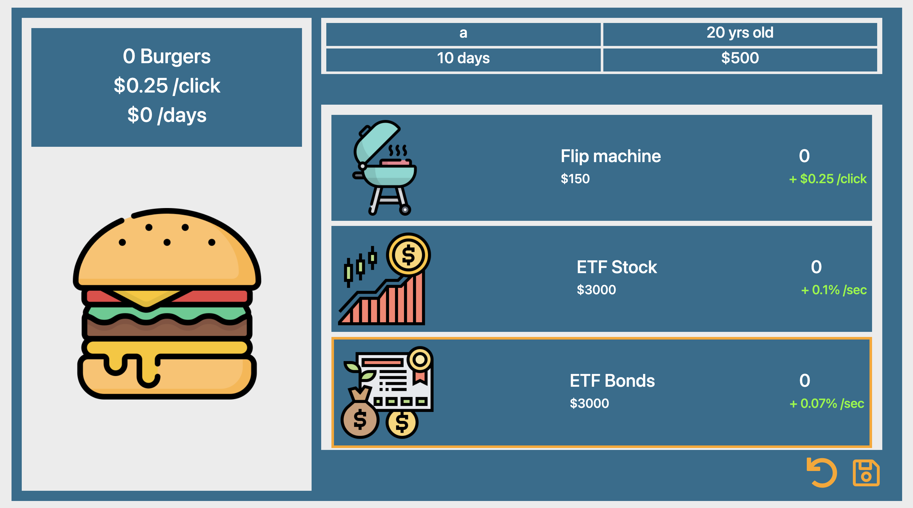

# Clicker-Empire-Game

This web application is an assignment from <a href="https://recursionist.io/">Recursion</a>(learning platform for computer science). 
This is a simulation game called "Clicker Empire Game". In this game, you can make money from work, investment, real estate, etc.
The purpose of the game is to build an empire in the city, aiming for a lot of money.

### How to play
To start game, type your name and click "New Game".
The user begins the game at 20 years old and as a hamburger flipping job at a fast food restaurant. One day passes every second.
You can earn $0.25 every time you click the hamburger. Users can save money to upgrade, invest, or buy real estate.
You can save your progress at anytime in the game. When you want to log back in, type the same name in the form and click "Load Game".

DO NOT TYPE NAME "Millionaire"!!!
### Screenshot

### URL
<a href="https://ogu89.github.io/Battery-Finder-Program/">https://ogu89.github.io/Clicker-Empire-Game/</a>

